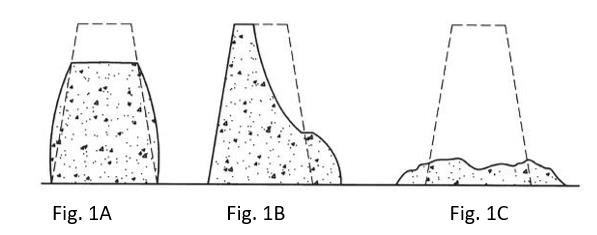
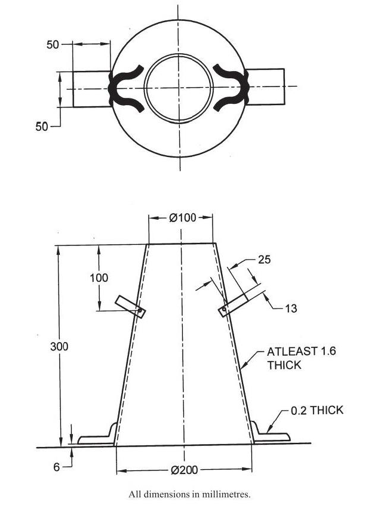

## Theory

As per IS 1199, workability is defined as the property of freshly mixed concrete that determines the ease and homogeneity with which it can be mixed, placed, compacted, and finished. Similarly, ASTM C125 defines workability as the effort required to manipulate a freshly mixed quantity of concrete with minimum loss of homogeneity. The term *manipulate* refers to early-age operations such as placing, compacting, and finishing.

The effort required to place concrete largely depends on the total work needed to initiate and sustain flow. This, in turn, is influenced by:

- The rheological properties of the cement paste (acting as a lubricant),
- Internal friction between aggregate particles, and
- External friction between the concrete and formwork surfaces.

Workability is a critical property in concrete technology as it directly affects constructability. It is a composite characteristic comprising two primary components:

1. **Consistency** – representing ease of flow or mobility, and
2. **Cohesiveness** – indicating stability against segregation and bleeding.

Consistency is commonly measured using the slump cone test or Vebe apparatus and serves as a simple index of flowability. The ease of compaction depends on the flow characteristics and the ability to reduce voids without compromising stability under applied pressure.

The most widely used test for assessing consistency is the slump test. This test is based on the principle that the consistency of fresh concrete can be evaluated by observing the behavior of a concrete sample under controlled conditions. The slump value represents the deformation of a compacted inverted cone of concrete under its own weight and provides an indication of the mix's wetness and workability.

In this test, fresh concrete is compacted into a mould shaped as a frustum of a cone. When the cone is carefully lifted vertically upwards, the concrete subsides. The vertical difference between the height of the mould and the displaced concrete (slump) is measured, which provides a quantitative measure of the consistency of the concrete.

The slump test is applicable for concretes with slump values ranging from 10 mm to 210 mm. For mixes outside this range, alternative methods for determining consistency should be adopted. The slump cone test can be conducted in both laboratory and field conditions to determine the consistency of concrete, provided that the nominal maximum size of aggregate does not exceed 38 mm, as specified in IS 1199.

In a slump test, the shape of the concrete after removal of the cone provides important insights into the workability and cohesiveness of the mix. Based on the deformation pattern, three types of slump may be observed as shown in Fig. 1:

- **True Slump (Fig 1A):** This refers to a uniform subsidence of the concrete mass, maintaining overall symmetry without disintegration. It indicates good workability and proper cohesion of the mix.
- **Shear Slump (Fig 1B):** In this case, one portion of the concrete mass shears off and slips sideways. This indicates a lack of cohesion in the mix and suggests a tendency for segregation and bleeding, which is undesirable for durability.
- **Collapse Slump (Fig 1C):** Here, the concrete collapses completely, indicating that the mix is excessively wet. Such a mix is generally considered unsuitable for proper quality control of workability using the slump test.

<!-- Image placeholder for Fig. 1: Types of Slump (True Slump, Shear Slump, Collapse Slump) -->

**Fig. 1: Types of Slump – (A) True Slump, (B) Shear Slump, (C) Collapse Slump**

The validity of the slump test depends on obtaining a true slump. If the specimen exhibits shear or collapse slump, the test should be repeated with a fresh sample. If two consecutive tests result in shear or collapse, the test is considered invalid, indicating that the concrete lacks the necessary plasticity and cohesiveness for the slump test to be applicable.

Further, IS 456:2000 provides recommended workability ranges based on placement conditions (Table 7, Clause 7.1). Typical values include:

- **Very Low (0–25 mm):** Suitable for applications such as concrete pavements
- **Low (25–50 mm):** Used for strip footings
- **Medium (50–100 mm):** Suitable for normal reinforced beams and columns
- **High (100–150 mm):** Used for pumped concrete and heavily reinforced sections

### Apparatus for Test

As specified in IS 1199, the following apparatus is required for conducting the slump test:

#### Mould (Slump Cone)

The mould used for preparing the test specimen shall:

- Be made of metal not readily attacked by cement paste, with a minimum thickness of 1.6 mm
- Have a smooth internal surface, free from dents and irregularities
- Be in the form of a hollow frustum of a cone

**Internal dimensions of the mould:**

- Diameter of base: 200 ± 2 mm
- Diameter of top: 100 ± 2 mm
- Height: 300 ± 2 mm

**Additional requirements:**

- Both ends (top and base) shall be open, parallel to each other, and perpendicular to the axis of the cone
- The mould shall be fitted with:
  - Two handles located at approximately two-thirds of its height
  - Fixing clamps or foot pieces at the base to hold it firmly during the test

A typical sketch of the mould (without guide) is generally provided in Fig. 2.

<!-- Image placeholder for Fig. 2: Mould for Slump Cone Test -->

**Fig. 2: Mould for Slump Cone Test (IS 1199: 2018)**

#### 2. Tamping Rod

The tamping rod used for compaction shall:

- Be made of steel with a circular cross-section
- Have a diameter of 16 ± 1 mm
- Have a length of 600 ± 5 mm
- Possess rounded ends to ensure uniform compaction

The rod may be extended using a handle (e.g., plastic conduit), provided that the total length does not exceed 1000 mm.
